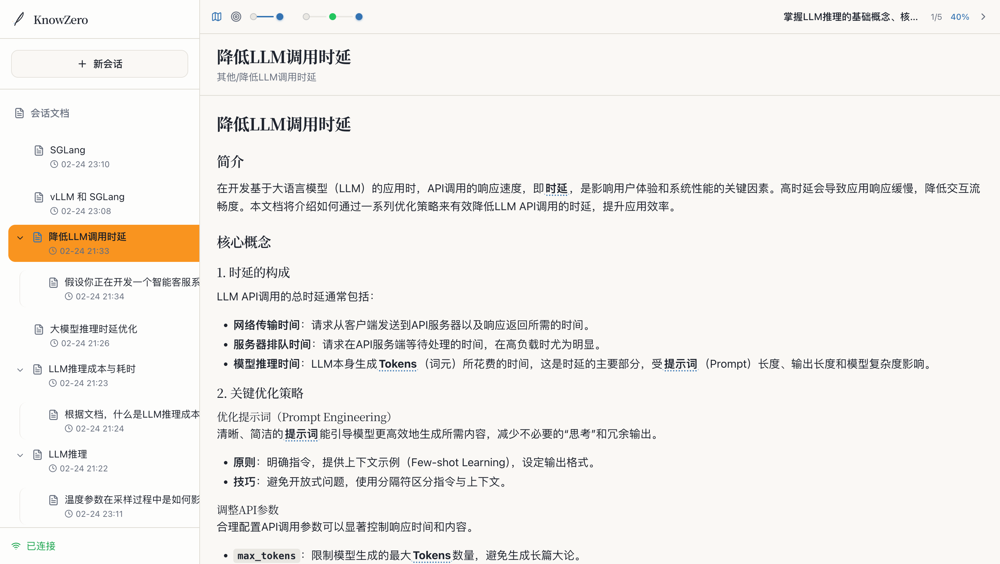
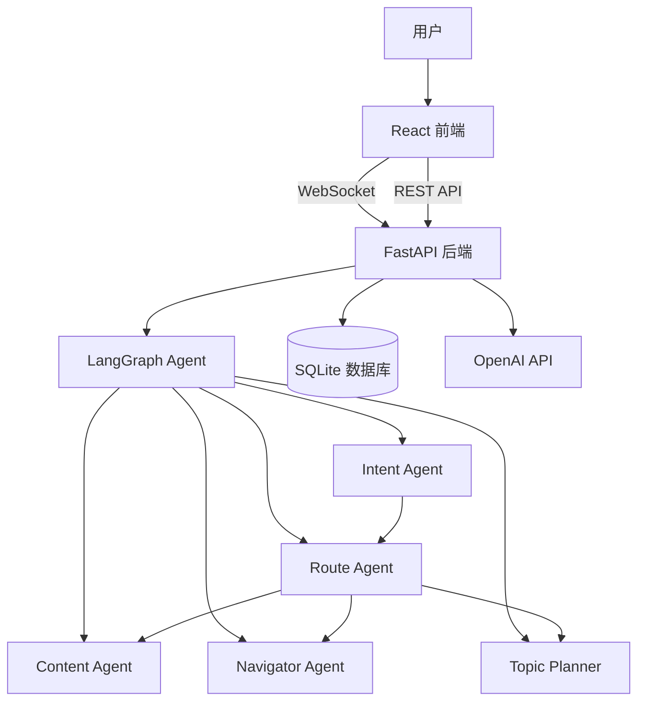

# KnowZero

> AI 驱动的知识探索平台

### 首页


### 会话界面



[在线演示](https://knowzero.starsou.com/) | [技术文档](docs/)

## 简介

KnowZero 是一个基于 FastAPI + React 的全栈 AI 学习平台。通过 LangGraph 实现的 AI Agent，平台能够智能生成学习内容、构建知识网络、规划学习路径，并提供流畅的流式输出体验。

## 核心功能

- **AI 智能生成** - 基于用户输入自动生成结构化的学习文档和知识图谱
- **知识网络** - 自动提取实体词，构建关联知识网络
- **学习路径** - 智能规划学习路线图，支持动态调整
- **流式输出** - WebSocket 实时流式响应，提供流畅的交互体验
- **会话管理** - 支持多会话、会话恢复和状态持久化

## 架构图



## 技术栈

| 层级 | 技术 |
|------|------|
| **后端** | FastAPI + SQLAlchemy 2.0 (async) + Pydantic v2 |
| **AI Agent** | LangGraph + LangChain + OpenAI |
| **数据库** | SQLite (aiosqlite) + Alembic |
| **前端** | React 18 + TypeScript + Vite + TailwindCSS |
| **状态管理** | Zustand + TanStack Query |

## 快速开始

### 后端

```bash
cd backend

# 安装依赖
pip install -e ".[dev]"

# 配置环境变量
cp .env.example .env

# 数据库迁移
alembic upgrade head

# 启动服务
uvicorn app.main:app --reload
```

后端 API 将运行在 http://localhost:8000

### 前端

```bash
cd frontend

# 安装依赖
npm install

# 启动开发服务器
npm run dev
```

前端应用将运行在 http://localhost:5173

## 文档

- [后端文档](backend/README.md) - FastAPI 后端架构和 API 说明
- [前端文档](frontend/README.md) - React 前端组件和开发指南
- [技术架构](docs/tech-arch.md) - 整体技术架构设计
- [Agent 架构](docs/agent-architecture.md) - LangGraph Agent 工作流设计
- [实体词索引](docs/entity-index-system.md) - 知识图谱设计

## 开发

### 后端

```bash
cd backend

# 代码格式化
ruff format .

# 代码检查
ruff check . --fix

# 类型检查
mypy app

# 运行测试
pytest
```

### 前端

```bash
cd frontend

# 代码检查
npm run lint

# 代码格式化
npm run format

# TypeScript 类型检查
npm run type-check
```

## License

MIT
