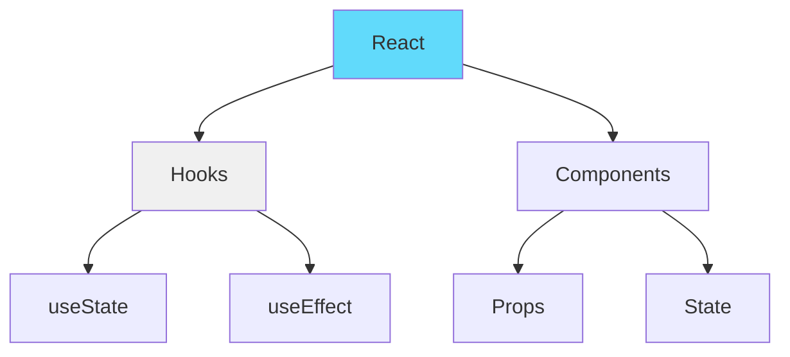
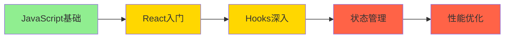
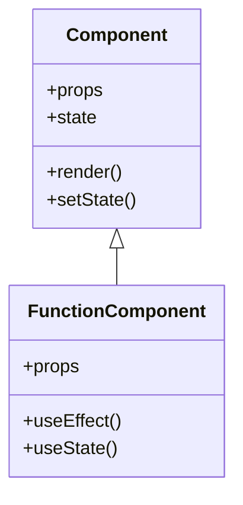
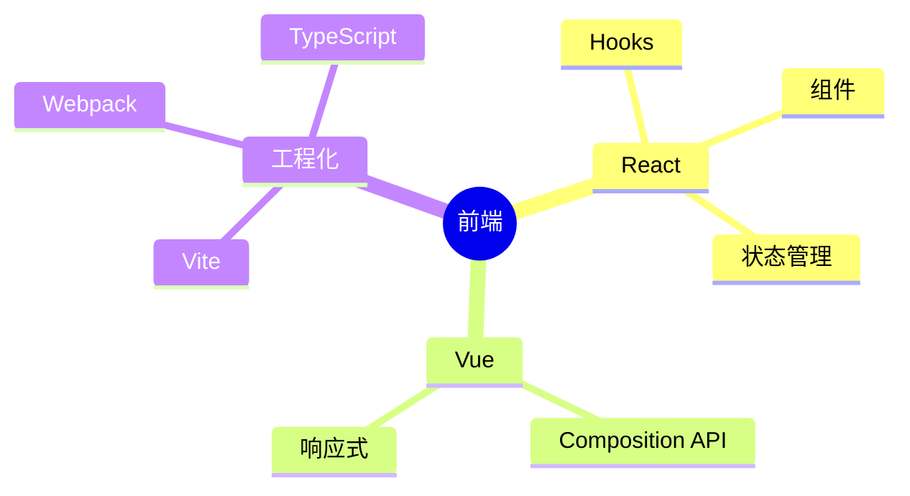
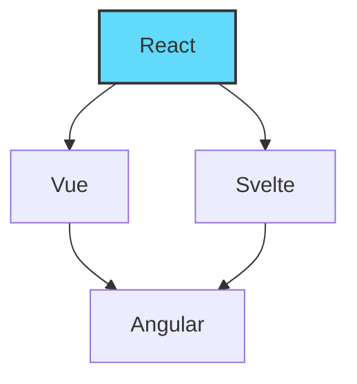
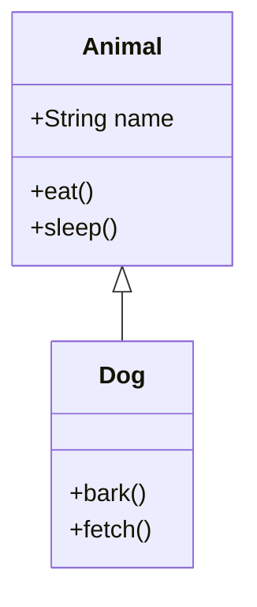
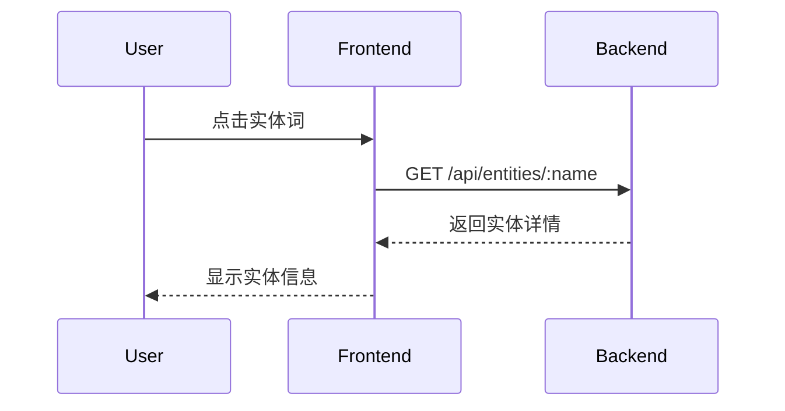
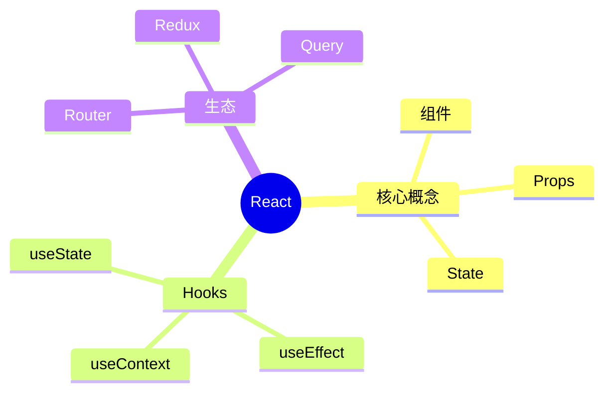

# KnowZero 功能增强规划 - Mermaid 知识可视化

## 背景

通过与 ChatGPT (Canvas)、Claude (Artifacts)、Perplexity AI 等顶级 Agent 产品的对比分析，KnowZero 在**知识可视化**方面存在明显短板。引入 Mermaid 可以有效弥补这一差距，提升用户体验。

## 目标

1. **可视化知识结构** - 将实体词关系以图形方式展示
2. **增强学习体验** - 通过图表帮助用户理解复杂概念
3. **差异化竞争** - 结合实体词系统，打造独特的知识图谱能力

---

## Mermaid 应用场景

### 1. 实体关系图谱

展示技术概念之间的关联关系：



### 2. 学习路径图

展示知识学习的先后顺序：



### 3. 技术概念类图

展示技术概念的类结构：



### 4. 文档知识网络（Mindmap）

展示知识体系的层次结构：



---

## 技术实现

### 架构设计

```
┌─────────────────────────────────────────────────────────────┐
│                      DocumentView                           │
├─────────────────────────────────────────────────────────────┤
│  ReactMarkdown                                             │
│    ├── h1, h2, h3, p, code, ul, ol...                      │
│    └── code block detector → MermaidChart                  │
│           └── mermaid.render() → SVG                       │
└─────────────────────────────────────────────────────────────┘
```

### 步骤 1: 安装依赖

```bash
cd frontend && pnpm add mermaid
```

### 步骤 2: 创建 MermaidChart 组件

**文件**: `frontend/src/components/Mermaid/MermaidChart.tsx`

```typescript
import React, { useEffect, useRef, useState } from 'react';
import mermaid from 'mermaid';

interface MermaidChartProps {
  chart: string;
  className?: string;
}

// 初始化 Mermaid（只执行一次）
mermaid.initialize({
  startOnLoad: false,
  theme: 'default',
  securityLevel: 'loose',
  // 支持深色模式切换
  themeVariables: {
    primaryColor: '#61dafb',
    primaryTextColor: '#fff',
  },
});

export const MermaidChart: React.FC<MermaidChartProps> = ({ chart, className }) => {
  const ref = useRef<HTMLDivElement>(null);
  const [error, setError] = useState<string | null>(null);

  useEffect(() => {
    if (!ref.current) return;

    // 生成唯一 ID
    const id = `mermaid-${Math.random().toString(36).substr(2, 9)}`;

    mermaid
      .render(id, chart)
      .then((result) => {
        if (ref.current) {
          ref.current.innerHTML = result.svg;
          setError(null);
        }
      })
      .catch((err) => {
        setError(err.message);
      });
  }, [chart]);

  if (error) {
    return (
      <div className={className}>
        <div className="rounded-lg border border-red-200 bg-red-50 p-4 text-red-600">
          <p className="font-medium">图表渲染失败</p>
          <p className="text-sm">{error}</p>
        </div>
      </div>
    );
  }

  return (
    <div
      ref={ref}
      className={className}
      style={{ display: 'flex', justifyContent: 'center' }}
    />
  );
};
```

### 步骤 3: 修改 DocumentView 集成 Mermaid

**文件**: `frontend/src/components/DocumentView/DocumentView.tsx`

在 `markdownComponents` 中添加 Mermaid 检测和处理：

```typescript
import { MermaidChart } from "@/components/Mermaid/MermaidChart";

const markdownComponents = useMemo(() => ({
  // ... 现有 h1, h2, h3, p, ul, ol, strong 组件 ...

  code: ({ children, className: codeClass }: {
    children?: React.ReactNode;
    className?: string;
  }) => {
    const isInline = !codeClass;
    const codeContent = String(children).replace(/\n$/, '');

    // 检测 Mermaid 代码块
    const isMermaid = codeClass?.includes('language-mermaid') ||
                      codeContent.startsWith('graph') ||
                      codeContent.startsWith('flowchart') ||
                      codeContent.startsWith('sequenceDiagram') ||
                      codeContent.startsWith('classDiagram') ||
                      codeContent.startsWith('erDiagram') ||
                      codeContent.startsWith('mindmap') ||
                      codeContent.startsWith('pie');

    if (isMermaid && !isInline) {
      return <MermaidChart chart={codeContent} className="my-4" />;
    }

    // 原有的代码块处理逻辑
    // ...
  },
}), [entitySet]);
```

---

## Agent 侧支持

### 系统提示词增强

**文件**: `backend/app/agent/nodes/content_agent.py` (或相关节点)

```python
# Mermaid 能力说明
MERMAID_INSTRUCTIONS = """
你可以使用 Mermaid 语法创建图表来可视化知识结构。

支持的图表类型：
- graph TD/LR - 流程图和关系图（Top-Down/Left-Right）
- flowchart - 高级流程图
- sequenceDiagram - 时序图
- classDiagram - 类图
- erDiagram - 实体关系图
- mindmap - 思维导图
- pie - 饼图

使用场景：
1. 展示概念之间的关系网络
2. 说明学习路径的先后顺序
3. 比较不同技术方案的差异
4. 展示技术架构或数据流
5. 可视化 API 调用流程

示例：
\`\`\`mermaid
graph TD
    React[React] --> Hooks[Hooks]
    React --> Components[组件]
    Hooks --> useState[useState]
    Hooks --> useEffect[useEffect]
\`\`\`
"""

# 修改内容生成 Prompt
def generate_content_prompt(topic: str, context: dict) -> str:
    return f"""请为用户解释 "{topic}"。

{MERMAID_INSTRUCTIONS}

当前上下文：
- 用户水平：{context.get('user_level', 'intermediate')}
- 相关实体：{context.get('entities', [])}
- 用户偏好：{context.get('user_preferences', {})}

要求：
1. 使用 Markdown 格式
2. 对于复杂的概念关系，优先使用 Mermaid 图表可视化
3. 适当使用代码示例
4. 保持清晰易懂，符合用户水平

回答结构建议：
1. 简短概述（1-2句）
2. Mermaid 关系图（如果有多个相关概念）
3. 详细解释
4. 代码示例（如果适用）
5. 相关实体链接
"""
```

### 示例效果

**用户问题**: "React Hooks 的关系是什么？"

**Agent 回答**:

```markdown
# React Hooks 体系

React Hooks 是 React 16.8 引入的特性，它们之间存在一定的关系和层次。

\`\`\`mermaid
graph TD
    Hooks[React Hooks] --> Basic[基础 Hooks]
    Hooks --> Additional[额外 Hooks]

    Basic --> useState[useState]
    Basic --> useEffect[useEffect]
    Basic --> useContext[useContext]

    Additional --> useReducer[useReducer]
    Additional --> useCallback[useCallback]
    Additional --> useMemo[useMemo]
    Additional --> useRef[useRef]

    useState -.-> useReducer
    useEffect -.-> useLayoutEffect

    style Basic fill:#90EE90
    style Additional fill:#FFD700
\`\`\`

## 基础 Hooks

- **useState**: 状态管理...
- **useEffect**: 副作用处理...
- **useContext**: 上下文消费...

## 额外 Hooks

- **useReducer**: 复杂状态管理...
- **useCallback**: 性能优化...
- **useMemo**: 计算缓存...
```

---

## 高级功能

### 1. 节点点击跳转

让 Mermaid 节点可点击，跳转到对应实体：

```typescript
// MermaidChart.tsx 增强版
export const MermaidChart: React.FC<MermaidChartProps> = ({
  chart,
  className,
  onEntityClick
}) => {
  // ... 渲染逻辑 ...

  useEffect(() => {
    mermaid.render(id, chart).then((result) => {
      if (ref.current) {
        ref.current.innerHTML = result.svg;

        // 添加点击事件
        const nodes = ref.current.querySelectorAll('.node');
        nodes.forEach((node) => {
          node.style.cursor = 'pointer';
          node.addEventListener('click', () => {
            const nodeId = node.getAttribute('data-id');
            if (nodeId && onEntityClick) {
              onEntityClick(nodeId);
            }
          });
        });
      }
    });
  }, [chart, onEntityClick]);
};
```

### 2. 深色模式支持

```typescript
import { useTheme } from '@/components/theme-provider';

mermaid.initialize({
  theme: useTheme().theme === 'dark' ? 'dark' : 'default',
});
```

### 3. 响应式图表

```typescript
const [zoom, setZoom] = useState(1);

<svg
  style={{
    transform: `scale(${zoom})`,
    transformOrigin: 'top center',
    maxWidth: '100%'
  }}
/>
```

### 4. 图片导出

允许用户将图表导出为 PNG/SVG：

```typescript
const exportChart = async () => {
  const svg = ref.current?.querySelector('svg');
  if (!svg) return;

  const svgData = new XMLSerializer().serializeToString(svg);
  const blob = new Blob([svgData], { type: 'image/svg+xml' });
  const url = URL.createObjectURL(blob);

  const a = document.createElement('a');
  a.href = url;
  a.download = 'knowledge-graph.svg';
  a.click();
};
```

---

## Mermaid 语法参考

### 关系图 (Graph)



### 类图 (Class Diagram)



### 时序图 (Sequence Diagram)



### 思维导图 (Mindmap)



---

## 开发任务清单

### Phase 1: 基础功能 (1-2 天)

- [ ] 安装 `mermaid` 依赖
- [ ] 创建 `MermaidChart` 组件
- [ ] 修改 `DocumentView` 集成 Mermaid
- [ ] 基础渲染测试

### Phase 2: Agent 增强 (1 天)

- [ ] 修改 Agent Prompt 添加 Mermaid 指令
- [ ] 测试 Agent 生成 Mermaid 图表
- [ ] 优化生成质量

### Phase 3: 高级功能 (2-3 天)

- [ ] 节点点击跳转
- [ ] 深色模式支持
- [ ] 图片导出功能
- [ ] 响应式适配

### Phase 4: 交互优化 (1-2 天)

- [ ] 图表加载动画
- [ ] 错误处理优化
- [ ] 性能优化（大图表）

---

## 测试计划

### 功能测试

1. **基础渲染测试**
   - 各类图表类型（graph, classDiagram, sequenceDiagram 等）
   - 错误语法处理
   - 空内容处理

2. **Agent 生成测试**
   - 测试 Agent 是否能正确生成 Mermaid 代码
   - 验证生成内容的准确性

3. **交互测试**
   - 节点点击跳转
   - 深色模式切换
   - 图片导出

### 性能测试

1. **大图表渲染性能**
2. **频繁切换性能**
3. **内存泄漏检测**

---

## 参考资料

### 官方文档
- [Mermaid.js 官方文档](https://mermaid.js.org/)
- [Mermaid Live Editor](https://mermaid.live/)
- [React Integration Guide](https://www.npmjs.com/package/mermaid)

### 社区资源
- "Visualizing Data Relationships: Crafting ER Diagrams with Mermaid.js" (Medium, Oct 2025)
- "告别复杂图表开发：3步实现React与Mermaid.js的完美集成" (CSDN, Sep 2025)

---

## 更新日志

| 日期 | 版本 | 更新内容 |
|------|------|----------|
| 2025-02-15 | 1.0 | 初始规划 |
